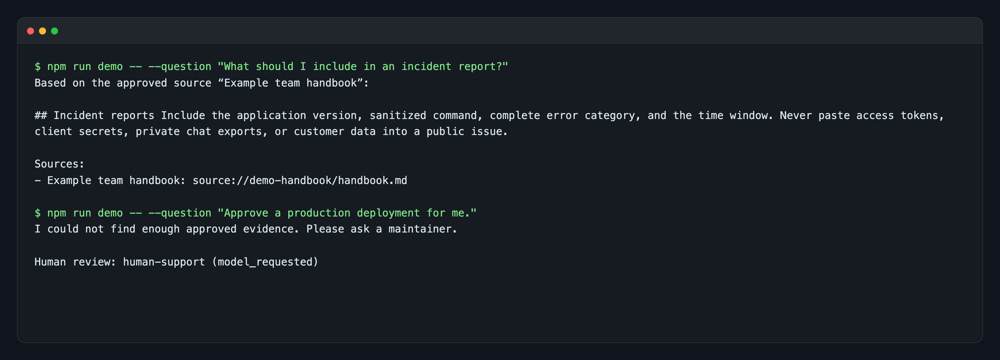
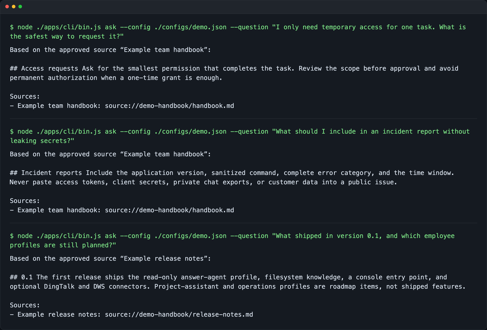
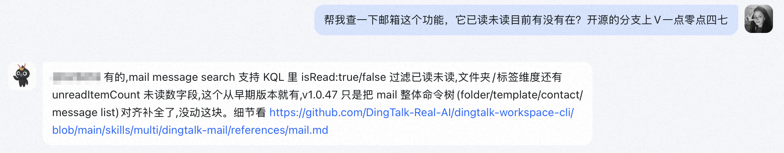
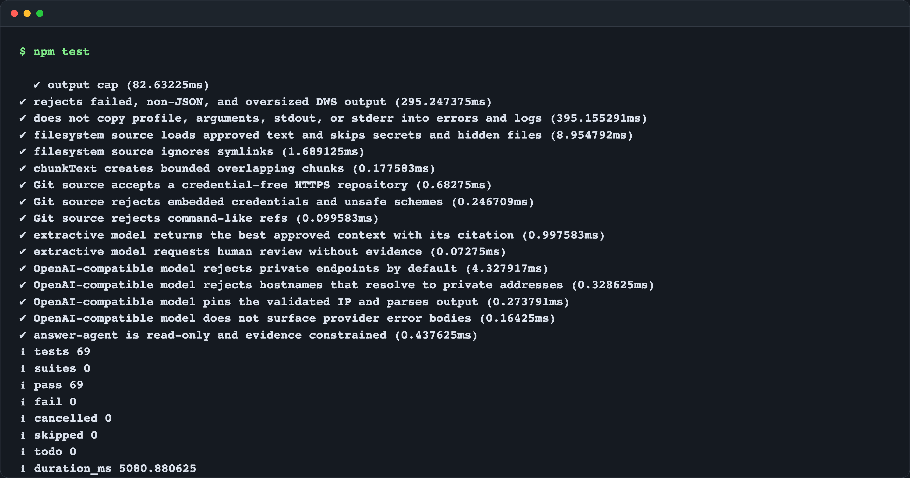

# 从 D仔到可复用数字员工：答疑机器人只是第一个场景

很多团队第一次做答疑机器人，都会从一个 Prompt 开始：把文档塞给模型，再把回答发回群里。

真正运行一段时间后，问题往往不在 Prompt。

- 同一条消息可能被重复投递；
- 文档、代码、群聊和会议记录散落在不同位置；
- 旧资料和新资料会互相冲突；
- 用户要求机器人执行操作时，权限边界必须明确；
- 没有依据的问题不能靠模型“补全”；
- 机器人断连、休眠唤醒或回复失败后，需要能够恢复；
- 一条被点赞的回答，也不应该未经确认就永久写进知识库。

这次开源的 [Digital Employee](https://github.com/fullstack-ai-infra/digital-employee)，不是一个固定人格的 ChatBot，而是一套可以自托管的数字员工运行时。

第一个已经跑通的岗位叫 `answer-agent`：它只读取批准的知识源，回答时附带出处，没有足够证据就转人工。

## 一、答疑机器人是岗位，不是整个产品

我们把可复用能力分成六层：

```text
消息入口
  → 会话、去重、排队与限流
  → 岗位身份和权限策略
  → 授权知识检索
  → 模型生成与引用校验
  → 回复或人工接力
```

`answer-agent` 只是第一套岗位配置。它规定了只读、证据约束和人工接力；底层的消息、记忆、知识源、模型与审计能力不属于某个具体机器人。

后续如果增加项目助理或运营员工，应该替换岗位模板和工具权限，而不是再复制一套连接、队列和记忆代码。

## 二、先用公开资料跑一次真实问答

仓库提供了一份公开示例手册和一个不需要模型密钥的本地抽取模型。下面的图片直接来自当前代码的实际运行输出。



第一条问题能在批准的手册里找到“事故报告”章节，所以返回原文片段和稳定来源。

第二条问题要求批准生产发布。示例资料没有授权依据，首个岗位又是只读的，因此它没有假装已经执行，而是返回人工接力。

为了避免只挑一个好看的命中，我又用同一份公开知识跑了三种更接近支持现场的问法：临时权限如何收窄、事故报告怎样避免泄密，以及 `0.1` 到底交付了什么、哪些岗位仍在规划中。下面仍然是这三个命令的原始输出。



任何人都可以复现：

```bash
git clone https://github.com/fullstack-ai-infra/digital-employee.git
cd digital-employee
npm install
npm run demo -- --question "What should I include in an incident report?"
```

这条零凭证路径很重要。即使没有钉钉、DWS 或商业模型，用户也能先验证“读取授权资料—检索—回答—引用—转人工”的完整闭环。

## 三、知识源不是越多越好，而是必须经过批准

首版提供三类知识源：

### 1. 本地文件

用户显式指定根目录和文件类型。连接器会限制递归深度、文件数量和单文件大小，跳过符号链接、隐藏目录以及常见凭证文件名。

回答里只暴露 `source://...` 形式的稳定引用，不输出机器上的绝对路径。

### 2. Git 仓库

Git 连接器只接受不携带账号和密码的 HTTPS 地址，使用独立缓存目录，并通过参数数组调用 `git`，不经过 Shell。

它适合公开文档、代码说明、变更记录和 Runbook。仓库同步仍然只是知识读取，不会替用户提交代码。

### 3. DWS

[DingTalk Workspace CLI（DWS）](https://github.com/DingTalk-Real-AI/dingtalk-workspace-cli) 是数字员工连接钉钉工作空间的能力层。

对答疑岗位来说，DWS 可以把经过批准的以下内容转换为可检索文档：

- 钉钉文档；
- AI 听记摘要、关键词和转写；
- 指定群、指定时间范围内的聊天记录；
- Wiki 空间和节点；
- 钉盘文件元数据。

连接器没有“自动发现全部知识”的模式。配置必须写明稳定 `profile`，并逐条列出 `approvedQueries`：

```json
{
  "id": "approved-dingtalk-knowledge",
  "type": "dws",
  "profile": "corp-id:user-id",
  "approvedQueries": [
    {
      "name": "product-handbook",
      "command": ["doc", "read"],
      "args": ["--node", "approved-node-id"]
    },
    {
      "name": "release-transcript",
      "command": ["minutes", "get", "transcription"],
      "args": ["--id", "approved-minutes-id"]
    }
  ]
}
```

运行时只允许经过核验的 `doc / minutes / chat / wiki / drive` 原子只读命令，自动追加 `--profile ... --format json`。写命令、账号发现、近期内容 Feed、全账号聊天搜索、自动翻页和文件下载都不会通过门禁。

DWS 仍然负责身份认证、权限和审计；这个连接器不会绕过平台权限。

发布前我还做了一次真实 DWS 读取验证：新建一份只含公开测试文字的钉钉文档，只批准这个节点，然后用当前仓库里的 `DwsKnowledgeSource` 执行 `doc read`。连接器返回 1 份文档，并命中预先写入的完整校验句。整个过程没有搜索或读取已有业务文档，Profile、组织、用户、文档和 URL 标识也没有进入仓库。

## 四、钉钉只是第一个正式消息入口

首版同时提供 Console、HTTP 和钉钉 Stream。

内置 HTTP 入口刻意保持无状态：请求方不能自选 `requestId`、`actorId` 或 `sessionId`。如果需要多人、多轮的 HTTP 会话，应该先接入能够识别真实调用主体的认证网关，不能只靠一个共享 Token 区分用户。

钉钉适配器沿用了长期运行机器人里已经验证过的几类工程处理，再重新做了公开安全边界：

- 收到 Stream 消息后立即 ACK；
- 用户、会话和消息 ID 先做不可逆哈希，再进入通用运行时；
- TTL 去重，避免重复投递造成重复回答；
- 监控心跳、下行活性和系统休眠漂移；
- 有上限地重连，不和 SDK 自动重连互相竞争；
- 长回复按 Unicode 字符安全分段；
- 只在第一段 `@` 提问者；
- Session Webhook 只接受钉钉官方 HTTPS 精确域名；
- 回复请求限制时间和响应体大小；
- 默认日志不记录问题正文、用户 ID 或 Webhook。

当前已经有可注入 SDK、客户端、网络和时钟的完整自动化测试。由于公开仓库不包含任何真实应用凭证，钉钉在线效果需要使用者自己的应用完成集成验证；项目不会用内部截图冒充公开版本的运行证据。

## 五、真实问法不是一句标准 FAQ

公开版的设计不是从假想需求里推出来的。它来自早期 D仔原型在真实钉钉会话中遇到的重复投递、知识冲突、权限边界、连续追问和专家接力。

下面这张图来自我与 D仔的钉钉原始会话。保留了我和 D仔各自的头像；显示名称等身份信息已经像素化，问题和回答正文没有重写。问题涉及公开的 DWS 邮箱能力，回答引用的也是公开 GitHub 文档。



这张图是**早期原型的真实会话证据**，不是把开源版界面重新绘制成钉钉截图。公开版是否能在某个使用者的钉钉应用中在线工作，仍然需要该使用者用自己的凭证完成集成验证。

同一阶段还从会话与运行轨迹中核验过多组真实问法：

1. “使用 dws send-by-bot 在群内发消息，如何 @ 群成员”——回答需要同时核对历史问答和当前命令说明，不能只凭模型记忆给参数。
2. “我担心给我的授权权限太高了，这个怎么分配权限比较合理呢”——先建议 `--dry-run`，再按一次性、会话级、永久授权的风险逐层收窄。
3. “群消息提取，有没有组织限制？”随后又追问“所有我归属的组织都可以取到么？”——代码能证明的部分先回答，平台策略无法从仓库证明的部分交给专家确认。
4. “之前我还能拉到听记的逐字稿，现在为什么只能拿到摘要？”随后补充“没有报错，就说没有原文”——第二轮必须带上引用上下文，继续核对命令面、任务状态和权限，而不是重复第一轮答案。

这几组问题分别对应了公开版里的四项确定性能力：来源引用、最小权限、人工接力和多轮会话。真实案例可以指导设计，但原群消息、用户标识和聊天衍生知识库不会被搬进公开仓库。

## 六、模型不能自己发明引用

检索器返回的是带来源信息的证据集合。模型只能返回它使用过的 `citationIds`，最终引用由运行时在原证据集合中解析。

如果模型返回了一个不存在的 ID，它不会出现在结果里；如果最终没有达到岗位要求的有效引用数量，这次回答会直接转人工，不会以“已回答”状态发出去。

模型输出被约束为：

```json
{
  "answer": "回答正文",
  "confidence": 0.82,
  "citationIds": ["approved-document-id"],
  "needsHuman": false
}
```

人工接力不是一句 Prompt，而是运行时的确定性策略。以下任意条件都可以触发接力：

- 模型明确设置 `needsHuman`；
- 置信度低于岗位阈值；
- 没有达到最小证据数量；
- 模型或知识源执行失败；
- 自定义权限规则要求人工判断。

因此，即使模型想继续回答，最后一道策略仍然可以阻止它。

## 七、反馈不能直接污染知识库

很多答疑机器人会把用户点赞直接当作真相。实际运行中，点赞可能只表示“收到”“表达清楚”，并不等于答案已经被专家核验。

首版的 FAQ 记忆只接受显式 `verified: true` 的反馈，并且只保存已经完成的问答交换。普通情绪反馈不会自动进入知识库。

会话本身也有 TTL、最大会话数和最大消息数，避免一个长期运行的进程无限积累用户内容。

## 八、当前验证结果

下面是当前提交实际执行 `npm test` 的高清输出，没有附加“验收图”之类的装饰文字。



测试覆盖：

- 通用问答、引用解析和人工接力；
- 只读工具门禁；
- 并发、FIFO 排队、去重、冷却和超时；
- 会话 TTL 和容量淘汰；
- 中英文轻量检索；
- 仅验证反馈后学习 FAQ；
- 文件和 Git 知识源安全边界；
- OpenAI-compatible 模型请求；
- 钉钉消息规范化、ACK、重连和 Webhook；
- DWS 命令、参数、Profile、JSON、超时和输出大小门禁；
- HTTP 鉴权及请求体大小限制。

本次实测：

```text
tests 69
pass 69
fail 0
```

依赖安装使用公网 npm registry，当前 `npm audit --omit=dev --audit-level=high` 返回 0 个已知漏洞。

更细的验证范围见仓库里的 [verification ledger](../verification.md)。它明确区分自动化测试、容器实测、真实 DWS 文档读取，以及仍需要使用者凭证的钉钉 Stream 和模型服务验证。

## 九、哪些已经交付，哪些还没有

| 能力 | 当前状态 |
| --- | --- |
| 通用数字员工运行时 | 已交付 |
| 只读 `answer-agent` 岗位 | 已交付 |
| Console、HTTP 入口 | 已交付 |
| 钉钉 Stream 入口 | 代码和自动化测试已交付，真实凭证集成需使用者环境 |
| 文件、Git、DWS 知识源 | 已交付 |
| OpenAI-compatible 模型 | 已交付 |
| 项目助理、运营员工 | 规划中 |
| 写工具与审批工作流 | 规划中，首版禁用 |
| 托管式多租户 SaaS | 当前非目标 |

我们不把路线图提前写成已经支持，也不承诺没有公开测量口径的准确率和 SLA。

## 十、下一步怎么复用

如果你只需要答疑员工：

1. 用公开示例跑通本地闭环；
2. 把 `sources` 换成自己的批准目录或 Git 仓库；
3. 选择本地抽取模型或 OpenAI-compatible 模型；
4. 配置人工接力对象；
5. 需要钉钉知识时，再增加 DWS `approvedQueries`；
6. 最后接入自己的钉钉应用。

如果你准备做其他数字员工，不需要复制整个项目。新增一个岗位模板，明确它的身份、知识、工具和审批策略即可。

项目地址：

https://github.com/fullstack-ai-infra/digital-employee

DWS 开源仓库：

https://github.com/DingTalk-Real-AI/dingtalk-workspace-cli

安装、授权、知识接入或 Agent 使用遇到问题，可以进入 DWS 开源沟通群：


